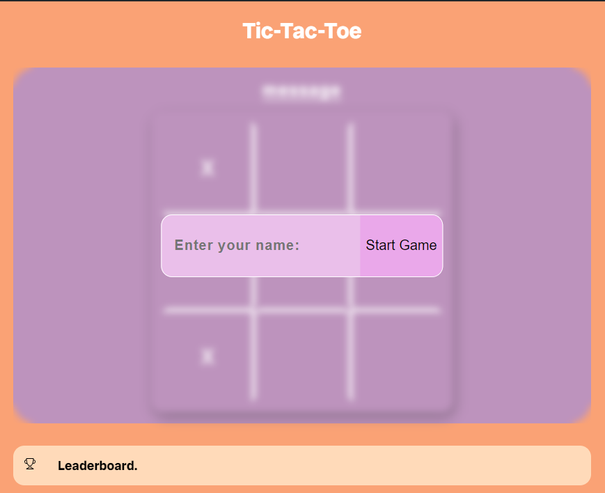

# Tic-Tac-Toe

This is a simple web-based Tic-Tac-Toe game built using Flask, SQLite, and NumPy. The game allows users to play against an AI opponent, and it also keeps track of wins, losses, and draws. User statistics are stored in an SQLite database, and a leaderboard is available to display the top players.




## Features

- Play Tic-Tac-Toe against an AI opponent
- User authentication with SQLite database to store wins, losses, and draws
- Dynamic leaderboard to show top players
- AI uses heuristics to determine the best move

## Live Demo

You can try out the game live at: [Tic-Tac-Toe Demo](https://tic-tac-toe-yfxi.onrender.com/)


## Installation

To run this project locally, follow these steps:

### 1. Clone the Repository

```bash
    git clone https://github.com/yourusername/tic-tac-toe.git
    cd tic-tac-toe
```

### run commands:

```bash 
   pip install -r requirements.txt
```

```bash 
    waitress-serve app:app 
```